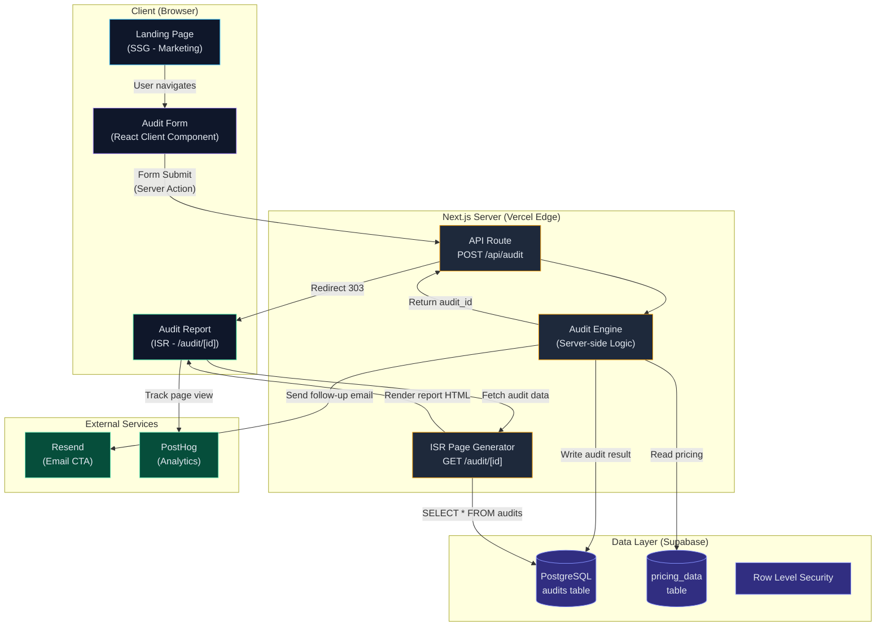
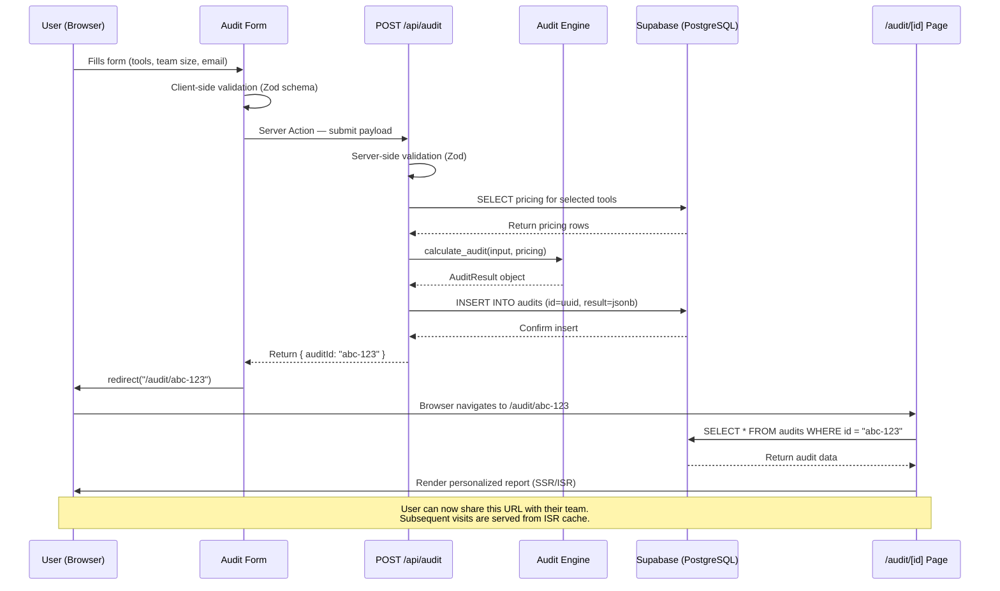
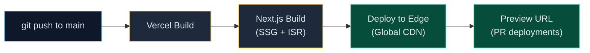

# ARCHITECTURE.md — AI Spend Audit by Saravanakumar

> **Document Status:** Discovery & Foundation Phase  
> **Last Updated:** 2026-05-07  
> **Author:** Saravanakumar Engineering

---

## 1. Product Overview

**AI Spend Audit** is a lead-generation web tool that helps startups identify overspending on AI tools (coding assistants, LLM subscriptions, and API usage). Users input their current AI stack and team size, receive a personalized audit report at a unique public URL, and are guided toward Saravanakumar's consulting services.

### Core User Flow

1. User lands on the marketing page → fills out the audit form
2. Engine calculates potential savings based on verified pricing data
3. A unique, shareable audit report is generated at `/audit/{id}`
4. Report includes a CTA to book a consultation with Saravanakumar

---

## 2. Stack Selection & Rationale

### Chosen Stack

| Layer            | Technology       | Version    |
| :--------------- | :--------------- | :--------- |
| **Framework**    | Next.js (App Router) | 15.x   |
| **Styling**      | Tailwind CSS     | 4.x        |
| **Database**     | Supabase (PostgreSQL + Auth) | Latest |
| **Hosting**      | Vercel           | —          |
| **Analytics**    | PostHog (self-hosted or cloud) | — |
| **Email/CTA**    | Resend           | —          |

### Why This Stack?

#### Next.js (App Router)
- **SSR + SSG hybrid:** The marketing landing page can be statically generated for SEO (Google indexes it instantly). Individual audit reports (`/audit/[id]`) use ISR (Incremental Static Regeneration) so the first visit generates the page, and subsequent visits serve cached HTML — **fast + shareable + crawlable**.
- **API Routes:** Server Actions and Route Handlers eliminate the need for a separate backend. The audit engine logic lives in `app/api/audit/route.ts`.
- **Edge Runtime:** Middleware can run at the edge for geo-routing, A/B testing, and rate limiting without a separate CDN config.
- **React Server Components:** Reduce client-side JS bundle. The report page ships almost zero JS to the browser — just static HTML with interactive CTAs.

#### Tailwind CSS
- **Rapid prototyping:** Utility-first CSS eliminates stylesheet sprawl during the fast iteration cycles of a startup project.
- **Design system ready:** `tailwind.config.ts` acts as a single source of truth for Saravanakumar brand tokens (colors, spacing, typography).
- **Dark mode:** Built-in `dark:` variant for the premium feel the audit report needs.

#### Supabase
- **Instant backend:** PostgreSQL database + Row Level Security + Auth + Realtime — all managed. No DevOps overhead.
- **Audit data storage:** Each submission creates a row in `audits` table with a UUID primary key → the UUID becomes the shareable URL slug.
- **Free tier:** Generous free tier (500MB DB, 50K monthly active users) — perfect for MVP validation before scaling.
- **Edge Functions:** If we need server-side logic outside Next.js (e.g., scheduled pricing data refreshes), Supabase Edge Functions (Deno) are available.

#### Vercel
- **Native Next.js hosting:** Zero-config deployment with automatic preview URLs for every PR.
- **Global CDN:** Static assets and ISR pages are served from edge nodes worldwide.
- **Analytics:** Built-in Web Vitals monitoring to track Core Web Vitals (LCP, FID, CLS) — critical for SEO.

---

## 3. System Architecture Diagram



---

## 4. User Input Flow — Form to Shareable URL



---

## 5. Database Schema (Supabase / PostgreSQL)

### `audits` Table

| Column          | Type         | Constraints       | Description                              |
| :-------------- | :----------- | :---------------- | :--------------------------------------- |
| `id`            | `uuid`       | PK, DEFAULT uuid_generate_v4() | Shareable URL slug          |
| `created_at`    | `timestamptz`| DEFAULT now()     | Submission timestamp                     |
| `company_name`  | `text`       | NOT NULL          | User's startup name                      |
| `team_size`     | `integer`    | NOT NULL, CHECK > 0 | Number of developers/users             |
| `email`         | `text`       | NOT NULL          | Contact email for lead gen               |
| `tools_input`   | `jsonb`      | NOT NULL          | Raw form data (tools selected, plans, quantities) |
| `audit_result`  | `jsonb`      | NOT NULL          | Computed audit output (savings, recommendations) |
| `monthly_spend` | `numeric`    | NOT NULL          | Calculated current monthly spend ($)     |
| `potential_savings` | `numeric` | NOT NULL         | Calculated potential savings ($)         |

### `pricing_data` Table

| Column          | Type         | Constraints       | Description                              |
| :-------------- | :----------- | :---------------- | :--------------------------------------- |
| `id`            | `serial`     | PK                | Auto-increment ID                        |
| `tool_slug`     | `text`       | NOT NULL, UNIQUE  | e.g., "cursor_pro", "chatgpt_plus"       |
| `tool_name`     | `text`       | NOT NULL          | Display name                             |
| `vendor`        | `text`       | NOT NULL          | e.g., "Anysphere", "OpenAI"             |
| `category`      | `text`       | NOT NULL          | "ide", "chatbot", "api"                 |
| `plan_name`     | `text`       | NOT NULL          | e.g., "Pro", "Business"                 |
| `price_monthly` | `numeric`    | NOT NULL          | Monthly price per seat/unit ($)          |
| `price_annual_monthly` | `numeric` |              | Annual plan price per month (if different)|
| `billing_model` | `text`       | NOT NULL          | "per_seat", "per_token", "flat"          |
| `token_input_1m`| `numeric`    |                   | API: $/1M input tokens                   |
| `token_output_1m`| `numeric`   |                   | API: $/1M output tokens                  |
| `verified_at`   | `date`       | NOT NULL          | Date pricing was last verified           |
| `source_url`    | `text`       | NOT NULL          | Official pricing page URL                |
| `notes`         | `text`       |                   | Caveats, credit systems, etc.            |

### Row Level Security

```sql
-- Audits: anyone can read (shareable URLs), only API can write
ALTER TABLE audits ENABLE ROW LEVEL SECURITY;
CREATE POLICY "Public read" ON audits FOR SELECT USING (true);
CREATE POLICY "Service write" ON audits FOR INSERT
  WITH CHECK (auth.role() = 'service_role');

-- Pricing: public read, admin-only write
ALTER TABLE pricing_data ENABLE ROW LEVEL SECURITY;
CREATE POLICY "Public read" ON pricing_data FOR SELECT USING (true);
CREATE POLICY "Admin write" ON pricing_data FOR ALL
  USING (auth.role() = 'service_role');
```

---

## 6. Key Directories & File Structure

```
ai-spend-audit/
├── app/
│   ├── page.tsx                  # Landing page (SSG)
│   ├── layout.tsx                # Root layout (fonts, meta, analytics)
│   ├── globals.css               # Tailwind base + custom design tokens
│   ├── audit/
│   │   └── [id]/
│   │       └── page.tsx          # Audit report page (ISR)
│   └── api/
│       └── audit/
│           └── route.ts          # POST endpoint (audit engine)
├── components/
│   ├── AuditForm.tsx             # Client component — multi-step form
│   ├── AuditReport.tsx           # Server component — report renderer
│   ├── ToolSelector.tsx          # Tool/plan picker with pricing preview
│   ├── SavingsChart.tsx          # Visual savings breakdown (Chart.js or Recharts)
│   └── CTASection.tsx            # Lead-gen call-to-action
├── lib/
│   ├── audit-engine.ts           # Core calculation logic (DO NOT BUILD YET)
│   ├── pricing.ts                # Pricing data access layer
│   ├── supabase.ts               # Supabase client initialization
│   └── validators.ts             # Zod schemas for form + API validation
├── data/
│   └── PRICING_DATA.md           # Human-readable pricing reference
├── public/
│   └── og-image.png              # Open Graph image for social sharing
├── ARCHITECTURE.md               # This document
├── tailwind.config.ts
├── next.config.ts
└── package.json
```

---

## 7. Performance & SEO Strategy

| Concern               | Solution                                                |
| :--------------------- | :------------------------------------------------------ |
| **First Contentful Paint** | SSG landing page — zero server wait                  |
| **Report Load Speed**  | ISR with 1-hour revalidation — cached at edge           |
| **Social Sharing**     | Dynamic OG images via `next/og` (ImageResponse API)     |
| **SEO Meta Tags**      | Per-page `metadata` export in App Router                |
| **Bundle Size**        | React Server Components — report page ships ~0 JS       |
| **Accessibility**      | Semantic HTML, ARIA labels, keyboard navigation         |
| **Mobile**             | Responsive design — Tailwind breakpoints                |

---

## 8. Security Considerations

- **Input Sanitization:** All user inputs validated with Zod on both client and server
- **Rate Limiting:** Vercel Edge Middleware with IP-based rate limiting (max 10 audits/hour/IP)
- **Data Privacy:** Email addresses stored in Supabase with RLS; no client-side exposure of service keys
- **CORS:** API routes restricted to same-origin by default
- **Environment Variables:** All secrets (Supabase keys, Resend API key) in Vercel environment config

---

## 9. Deployment Pipeline



---

## 10. Open Decisions (To Resolve Before Implementation)

| # | Decision | Options | Recommendation |
|---|----------|---------|----------------|
| 1 | Chart library for savings visualization | Recharts vs. Chart.js vs. D3 | Recharts (React-native, tree-shakeable) |
| 2 | Email service for follow-up | Resend vs. SendGrid vs. Postmark | Resend (developer-friendly, React Email templates) |
| 3 | Analytics depth | PostHog vs. Vercel Analytics vs. Plausible | PostHog (self-hosted option, funnels, session replay) |
| 4 | Authentication for repeat users | None vs. magic link vs. OAuth | None for MVP — audit is anonymous, email is collected for lead gen |
| 5 | Pricing data refresh strategy | Manual via admin UI vs. automated scraping | Manual for MVP — pricing pages change infrequently |
